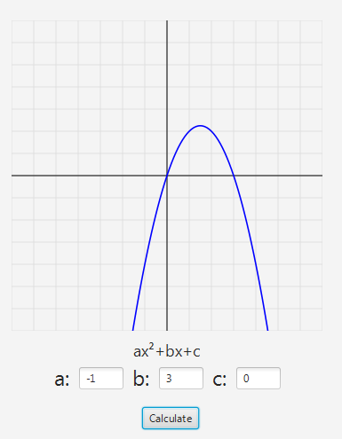

# Equation Grapher

## Description
This JavaFX project creates a Cartesian plane and graphs a quadratic equation (parabola) based on coefficients A, B, and C provided by the user.

## Prerequisites
- JDK 8 or higher installed on your system.
- JavaFX SDK set up in your development environment.

## Screenshot 

